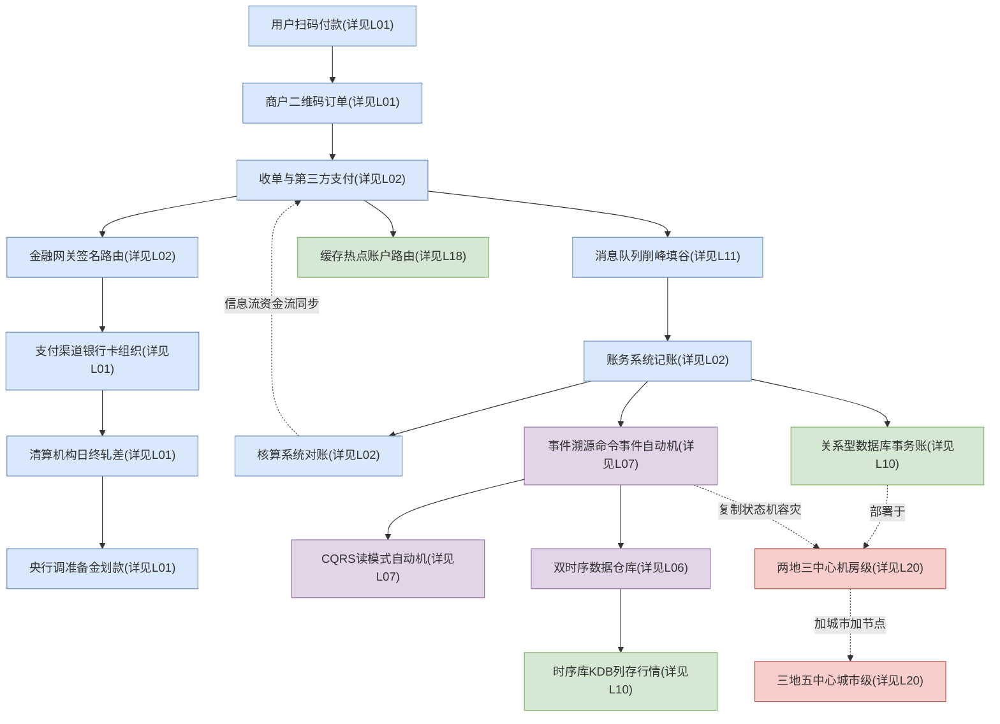

四色四域：蓝=支付链路，紫=数据系统，绿=存储层，红=容灾部署；label 末尾附讲次出处。

```mermaid
flowchart TD
    U["用户扫码付款(详见L01)"] --> MER["商户二维码订单(详见L01)"]
    MER --> ACQ["收单与第三方支付(详见L02)"]
    ACQ --> GW["金融网关签名路由(详见L02)"]
    GW --> CH["支付渠道银行卡组织(详见L01)"]
    CH --> CLR["清算机构日终轧差(详见L01)"]
    CLR --> PBOC["央行调准备金划款(详见L01)"]
    ACQ --> MQ["消息队列削峰填谷(详见L11)"]
    MQ --> ACC["账务系统记账(详见L02)"]
    ACC --> REC["核算系统对账(详见L02)"]
    REC -.->|"信息流资金流同步"| ACQ
    ACC --> ES["事件溯源命令事件自动机(详见L07)"]
    ES --> CQRS["CQRS读模式自动机(详见L07)"]
    ES --> DW["双时序数据仓库(详见L06)"]
    ACC --> RDB["关系型数据库事务账(详见L10)"]
    DW --> TSDB["时序库KDB列存行情(详见L10)"]
    ACQ --> CACHE["缓存热点账户路由(详见L18)"]
    RDB -.->|"部署于"| DR1["两地三中心机房级(详见L20)"]
    ES -.->|"复制状态机容灾"| DR1
    DR1 -.->|"加城市加节点"| DR2["三地五中心城市级(详见L20)"]
    classDef cFlow fill:#dae8fc,stroke:#6c8ebf
    classDef cData fill:#e1d5e7,stroke:#9673a6
    classDef cStore fill:#d5e8d4,stroke:#82b366
    classDef cDR fill:#f8cecc,stroke:#b85450
    class U,MER,ACQ,GW,CH,CLR,PBOC,ACC,REC,MQ cFlow
    class ES,CQRS,DW cData
    class RDB,TSDB,CACHE cStore
    class DR1,DR2 cDR
```
