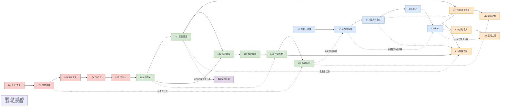

实线=后一讲建立在前一讲上；虚线=跨讲次综合运用与互相印证。

```mermaid
flowchart LR
    BIZ1["L01 扫码支付"]
    BIZ2["L02 支付原理"]
    BIZ3["L03 金融业务"]
    BIZ4["L04 DDD上"]
    BIZ5["L05 DDD下"]
    COR1["L06 双时序"]
    COR2["L07 事件溯源"]
    COR3["L08 结果保障"]
    COR4["L09 数据传输"]
    COR5["L10 存储选型"]
    COR6["L11 系统优化"]
    THY1["L12 单机一致性"]
    THY2["L13 分布式事务"]
    THY3["L14 容灾一致性"]
    THY4["L15 FLP"]
    THY5["L16 Raft"]
    CAS1["L17 多机事件溯源"]
    CAS2["L18 数据方案"]
    CAS3["L19 动态分库"]
    CAS4["L20 实时容灾"]
    CAS5["L21 混沌工程"]
    SPR["春3 案例拆解"]
    BIZ1 --> BIZ2 --> BIZ3 --> BIZ4 --> BIZ5 --> COR1
    COR1 --> COR2 --> COR3 --> COR4 --> COR5 --> COR6
    COR1 --> COR3
    THY1 --> THY2 --> THY3 --> THY4 --> THY5
    THY5 --> CAS1
    COR2 --> CAS1
    CAS1 --> CAS3
    THY5 --> CAS2
    COR5 --> CAS2
    THY5 --> CAS4
    CAS4 --> CAS5
    COR1 -.-> COR5
    COR6 -.->|"分库引出事务"| THY2
    THY2 -.->|"协调者单点求解"| THY5
    THY3 -.-> CAS1
    THY3 -.-> CAS2
    COR2 -.->|"日志即状态"| CAS2
    COR6 -.-> CAS3
    THY5 -.->|"不可形式化证明"| CAS5
    COR2 -.->|"CQRS与溯源迁移"| SPR
    BIZ2 -.->|"秒杀异步化"| COR6
    LEG["图例: 实线=前置依赖<br/>虚线=综合运用互证"]
    classDef cBiz fill:#f8cecc,stroke:#b85450
    classDef cCor fill:#d5e8d4,stroke:#82b366
    classDef cThy fill:#dae8fc,stroke:#6c8ebf
    classDef cCas fill:#ffe6cc,stroke:#d79b00
    classDef cSpr fill:#e1d5e7,stroke:#9673a6
    class BIZ1,BIZ2,BIZ3,BIZ4,BIZ5 cBiz
    class COR1,COR2,COR3,COR4,COR5,COR6 cCor
    class THY1,THY2,THY3,THY4,THY5 cThy
    class CAS1,CAS2,CAS3,CAS4,CAS5 cCas
    class SPR cSpr
```
