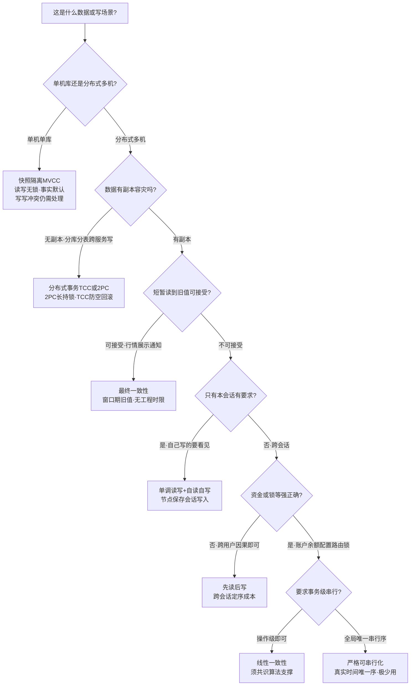

从"这是什么数据"出发，六个判断、七个叶子，对应第 12/13/14 讲的实际分级。

```mermaid
flowchart TD
    R["这是什么数据或写场景?"] --> Q1{"单机库还是分布式多机?"}
    Q1 -->|"单机单库"| L1["快照隔离MVCC<br/>读写无锁·事实默认<br/>写写冲突仍需处理"]
    Q1 -->|"分布式多机"| Q2{"数据有副本容灾吗?"}
    Q2 -->|"无副本·分库分表跨服务写"| L2["分布式事务TCC或2PC<br/>2PC长持锁·TCC防空回滚"]
    Q2 -->|"有副本"| Q3{"短暂读到旧值可接受?"}
    Q3 -->|"可接受·行情展示通知"| L3["最终一致性<br/>窗口期旧值·无工程时限"]
    Q3 -->|"不可接受"| Q4{"只有本会话有要求?"}
    Q4 -->|"是·自己写的要看见"| L4["单调读写+自读自写<br/>节点保存会话写入"]
    Q4 -->|"否·跨会话"| Q5{"资金或锁等强正确?"}
    Q5 -->|"否·跨用户因果即可"| L5["先读后写<br/>跨会话定序成本"]
    Q5 -->|"是·账户余额配置路由锁"| Q6{"要求事务级串行?"}
    Q6 -->|"操作级即可"| L6["线性一致性<br/>须共识算法支撑"]
    Q6 -->|"全局唯一串行序"| L7["严格可串行化<br/>真实时间唯一序·极少用"]
```
