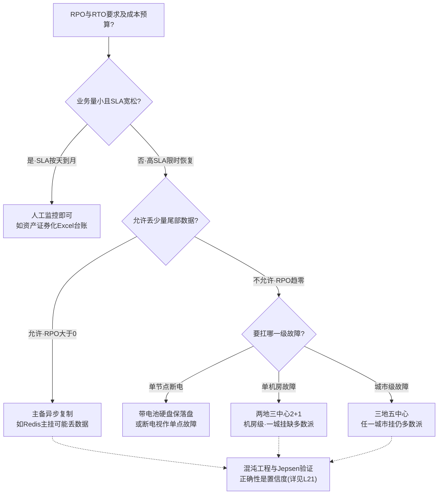

以成本三角（服务质量/事务正确性/成本）为根，叶子是第 20 讲的部署结论，附第 21 讲验证收尾。

```mermaid
flowchart TD
    R["RPO与RTO要求及成本预算?"] --> Q1{"业务量小且SLA宽松?"}
    Q1 -->|"是·SLA按天到月"| L1["人工监控即可<br/>如资产证券化Excel台账"]
    Q1 -->|"否·高SLA限时恢复"| Q2{"允许丢少量尾部数据?"}
    Q2 -->|"允许·RPO大于0"| L2["主备异步复制<br/>如Redis主挂可能丢数据"]
    Q2 -->|"不允许·RPO趋零"| Q3{"要扛哪一级故障?"}
    Q3 -->|"单节点断电"| L3["带电池硬盘保落盘<br/>或断电视作单点故障"]
    Q3 -->|"单机房故障"| L4["两地三中心2+1<br/>机房级·一城挂缺多数派"]
    Q3 -->|"城市级故障"| L5["三地五中心<br/>任一城市挂仍多数派"]
    L2 -.-> V["混沌工程与Jepsen验证<br/>正确性是置信度(详见L21)"]
    L4 -.-> V
    L5 -.-> V
```
