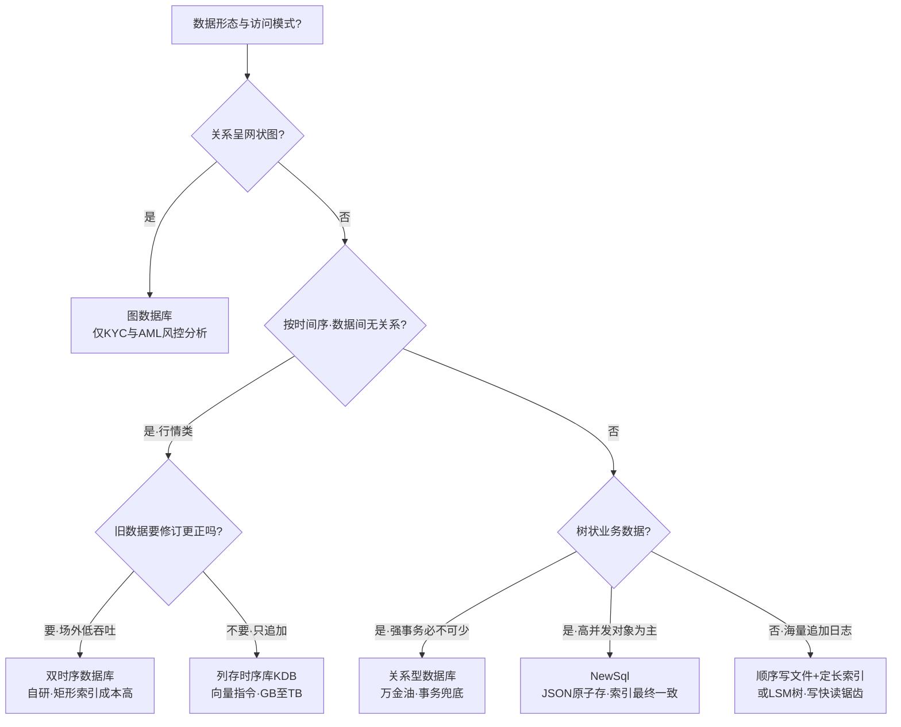

从数据形态与访问模式出发，叶子落到第 10 讲的引擎结论（辅以第 7/18 讲的日志存储）。

```mermaid
flowchart TD
    R["数据形态与访问模式?"] --> Q1{"关系呈网状图?"}
    Q1 -->|"是"| L1["图数据库<br/>仅KYC与AML风控分析"]
    Q1 -->|"否"| Q2{"按时间序·数据间无关系?"}
    Q2 -->|"是·行情类"| Q3{"旧数据要修订更正吗?"}
    Q3 -->|"要·场外低吞吐"| L2["双时序数据库<br/>自研·矩形索引成本高"]
    Q3 -->|"不要·只追加"| L3["列存时序库KDB<br/>向量指令·GB至TB"]
    Q2 -->|"否"| Q4{"树状业务数据?"}
    Q4 -->|"是·强事务必不可少"| L4["关系型数据库<br/>万金油·事务兜底"]
    Q4 -->|"是·高并发对象为主"| L5["NewSql<br/>JSON原子存·索引最终一致"]
    Q4 -->|"否·海量追加日志"| L6["顺序写文件+定长索引<br/>或LSM树·写快读锯齿"]
```
