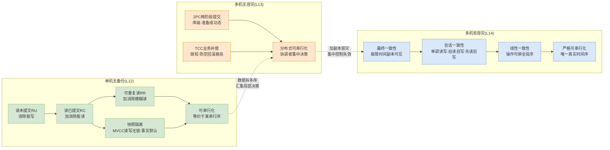

组内箭头按保证强度递增，组间虚线为环境升级维度（依据第 12/13/14 讲）。

```mermaid
flowchart LR
    subgraph S1["单机无备份(L12)"]
        A1["读未提交RU<br/>消除脏写"]
        A2["读已提交RC<br/>加消除脏读"]
        A3["可重复读RR<br/>加消除模糊读"]
        A4["快照隔离<br/>MVCC读写无锁·事实默认"]
        A5["可串行化<br/>等价于某串行序"]
        A1 --> A2
        A2 --> A3
        A3 --> A5
        A2 --> A4
        A4 --> A5
    end
    subgraph S2["多机无容灾(L13)"]
        B2["2PC两阶段提交<br/>库级·准备成功态"]
        B3["TCC业务补偿<br/>锁短·防空回滚悬挂"]
        B1["分布式可串行化<br/>协调者集中决策"]
        B2 --> B1
        B3 --> B1
    end
    subgraph S3["多机有容灾(L14)"]
        C1["最终一致性<br/>极限时间副本可见"]
        C2["会话一致性<br/>单调读写·自读自写·先读后写"]
        C3["线性一致性<br/>操作可排全局序"]
        C4["严格可串行化<br/>唯一真实时间序"]
        C1 --> C2
        C2 --> C3
        C3 --> C4
    end
    A5 -.->|"数据拆多库<br/>汇集局部决策"| B1
    B1 -.->|"加副本容灾<br/>集中控制失效"| C1
    classDef g1 fill:#d5e8d4,stroke:#82b366
    classDef g2 fill:#ffe6cc,stroke:#d79b00
    classDef g3 fill:#dae8fc,stroke:#6c8ebf
    class A1,A2,A3,A4,A5 g1
    class B1,B2,B3 g2
    class C1,C2,C3,C4 g3
```
